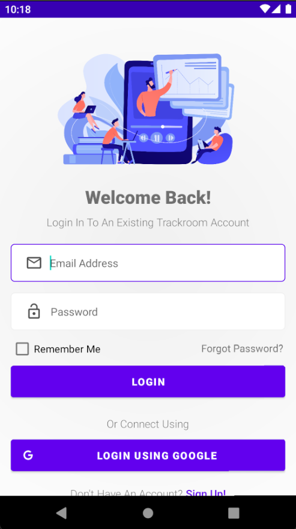
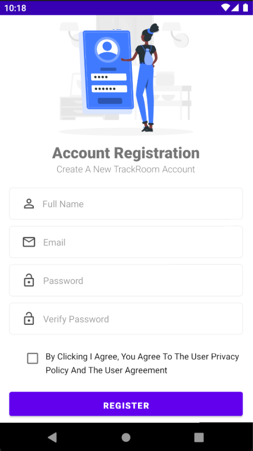
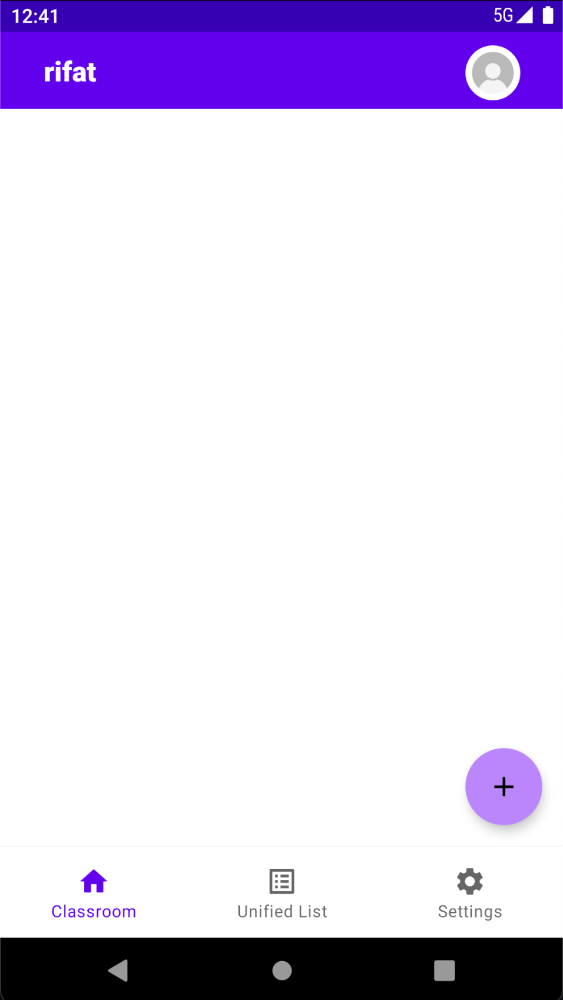

# Trackroom
An advance classroom app on ios that lets you both teach and enroll in classes. 

- Dependencies
```
    implementation 'com.squareup.retrofit2:retrofit:2.4.0'
    implementation 'com.squareup.okhttp3:logging-interceptor:4.4.0'
    implementation 'com.squareup.retrofit2:converter-gson:2.4.0'
    implementation 'de.hdodenhof:circleimageview:3.1.0'
    implementation 'com.github.bumptech.glide:glide:4.12.0'
    implementation 'com.google.firebase:firebase-storage:19.2.2'
    implementation 'com.github.barteksc:android-pdf-viewer:2.8.2'
    implementation 'com.google.android.gms:play-services-auth:19.2.0'
    implementation 'com.google.android.gms:play-services-cast-framework:20.0.0'
    annotationProcessor 'com.github.bumptech.glide:compiler:4.12.0'
``` 

If you are running the server locally make sure to adjust the ip address for the request.

Use the Interface and Model files to customize the request and response to your needs.

# Screenshots

  

